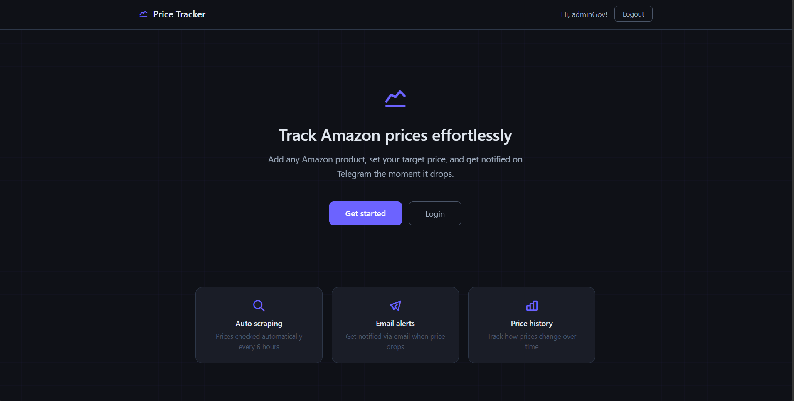
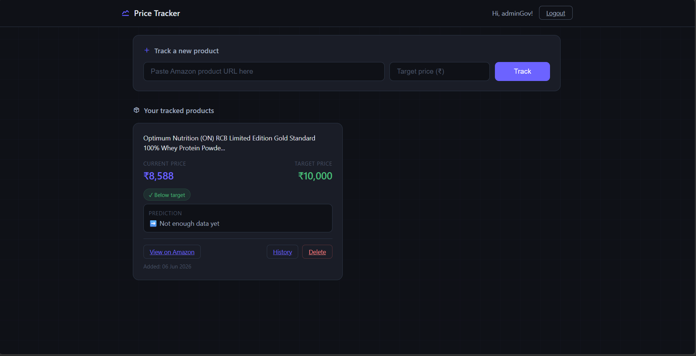
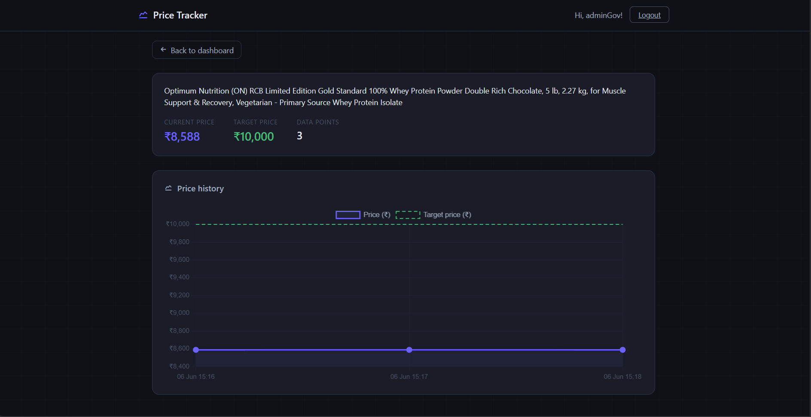

# 📈 Amazon Price Tracker

A full-stack web application that tracks Amazon product prices and sends email alerts when prices drop below your target price.

## 🌐 Live Demo
**[https://Govind707.pythonanywhere.com](https://Govind707.pythonanywhere.com)**

## 🌟 Features

- 🔍 **Real-time price scraping** — Fetches live prices from Amazon India using BeautifulSoup and ScraperAPI
- 📧 **Email alerts** — Get notified instantly when a product drops below your target price
- 📊 **Price history graph** — Visualize price trends over time using Chart.js
- 🤖 **ML price prediction** — Linear Regression model predicts whether prices will rise or fall
- 🔐 **User authentication** — Register, login, and OTP email verification
- ⏰ **Automatic scheduling** — Prices checked every 6 hours using APScheduler
- 🌙 **Dark theme UI** — Clean, minimal dark themed interface

## 🛠️ Tech Stack

| Layer | Technology |
|---|---|
| Backend | Python, Flask |
| Database | SQLite, SQLAlchemy |
| Scraping | BeautifulSoup, ScraperAPI |
| ML | scikit-learn, NumPy |
| Frontend | HTML, CSS, Chart.js, Tabler Icons |
| Auth | Flask-Login, Flask-Bcrypt |
| Email | Flask-Mail, Gmail SMTP |
| Scheduler | APScheduler(local),cron-job.org (production) |

## 📸 Screenshots

### Landing Page


### Dashboard


### Price History Graph


## 🚀 Getting Started

### Prerequisites
- Python 3.10+
- Gmail account with App Password
- ScraperAPI account (free tier)

### Installation

**1. Clone the repository:**
```bash
git clone https://github.com/govind707-codez/amazon-price-tracker.git
cd amazon-price-tracker
```

**2. Create and activate virtual environment:**
```bash
python -m venv .venv
.venv\Scripts\activate  # Windows
source .venv/bin/activate  # Mac/Linux
```

**3. Install dependencies:**
```bash
python -m pip install -r requirements.txt
```

**4. Create `.env` file:**

SECRET_KEY=your_secret_key
MAIL_USERNAME=yourgmail@gmail.com
MAIL_PASSWORD=your_gmail_app_password
SCRAPER_API_KEY=your_scraperapi_key
CRON_TOKEN=your_random_token

**5. Run the app:**
```bash
python app.py
```

**6. Visit:**

http://127.0.0.1:5000

## ⚙️ How It Works

User adds Amazon product URL + target price
    → ScraperAPI fetches product details
    → Price stored in SQLite database
    → cron-job.org triggers price check every hour
    → If price drops below target → email alert sent
    → Price history saved for graph and ML prediction

## 🤖 ML Price Prediction

Uses **Linear Regression** (scikit-learn) on collected price history to predict future price trends:

- 📉 **Dropping** — Price trending down, good time to wait
- 📈 **Rising** — Price trending up, consider buying soon  
- ➡️ **Stable** — Price is stable

## 🚀 Deployment

Deployed on **PythonAnywhere** (free tier):
- Live at [https://Govind707.pythonanywhere.com](https://Govind707.pythonanywhere.com)
- Automated price checks via cron-job.org every hour
- Gmail SMTP for email alerts

## 📁 Project Structure

amazon-price-tracker/
├── app.py          # Flask app and routes
├── models.py       # Database models
├── scraper.py      # Amazon scraper + email alerts
├── scheduler.py    # Background price checker
├── predictor.py    # ML price prediction
├── check_prices.py     # Price checker (production)
├── requirements.txt
├── static/
│   └── css/
│       └── style.css
└── templates/
├── base.html
├── index.html
├── dashboard.html
├── history.html
├── login.html
├── register.html
└── verify_otp.html

## ⚠️ Known Limitations

- Price fetching may take 10-15 seconds due to Amazon's anti-scraping measures
- ML prediction requires at least 3 price history data points
- Free ScraperAPI tier limited to 1,000 requests/month

## 📄 License

MIT License — feel free to use this project for learning and portfolio purposes.